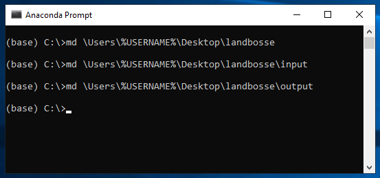
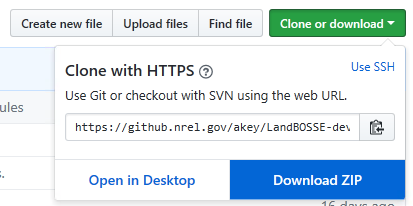
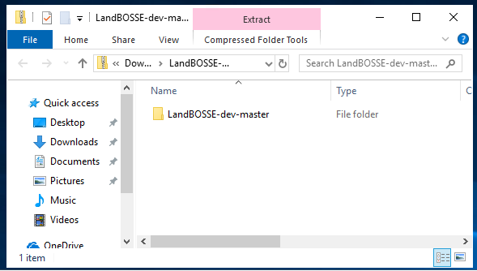
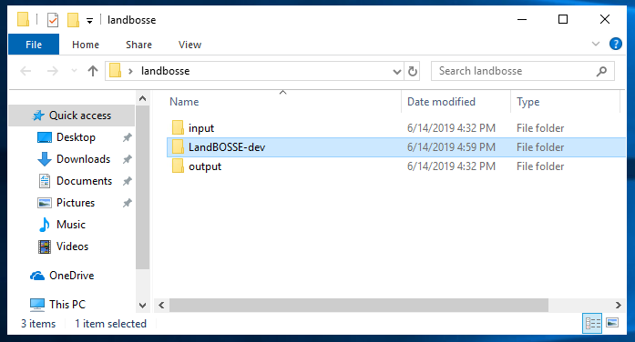
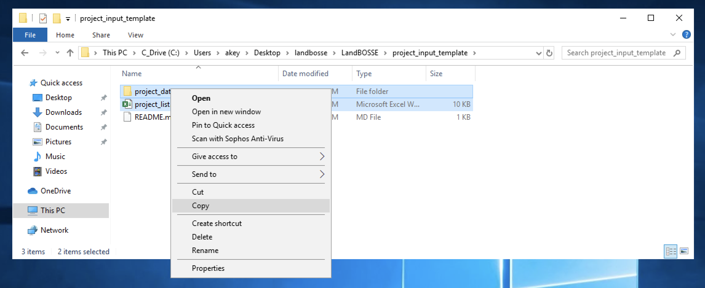
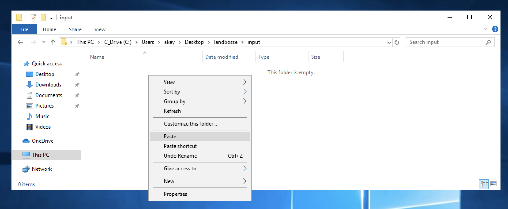
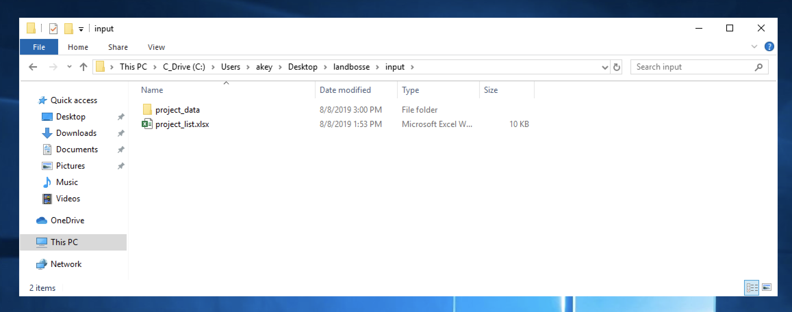

# LandBOSSE Installation

## Windows Installation for End Users

### Step 1: Install Anaconda

You will need the Anaconda distribution of Python. You need the distribution with **Python 3.7** or higher.

[https://www.anaconda.com/distribution/](https://www.anaconda.com/distribution/)

### Step 2: Launch the Anaconda Prompt

LandBOSSE is a command line tool. You will need to launch the Anaconda prompt (either "Anaconda Prompt" or "Anaconda Powershell Prompt" will work.) Search your start menu for "Anaconda3" and you should get a folder ike the one below which lets you select the Anaconda prompt. As you type commands, you should not get error messages. This is indicated by *no messages* after you type the command.


### Step 3: Create three data folders

You need 3 folders on your desktop for LandBOSSE data. You can certainly put them in a place other than your desktop, but you will need to modify the commands below if you do.

Your command prompt will look something like the following:



This is what you should type:

```
md \Users\%USERNAME%\Desktop\landbosse
md \Users\%USERNAME%\Desktop\landbosse\input
md \Users\%USERNAME%\Desktop\landbosse\output
```

### Step 4: Get the source code

If you are familiar with `git` and GitHub and have a workflow to use to obtain the source code, please skip to the next step. 

However, if you are unfamiliar with `git` and GitHub you can simply download the `.zip` file. Find the main GitHub page for this project [https://github.com/WISDEM/LandBOSSE](https://github.com/WISDEM/LandBOSSE).



Click on "Download ZIP" to download the `.zip` file.

### Step 5: Get the source code ready

Open the `.zip` file. Copy the single directory within it to the `landbosse` folder on the desktop. Rename the directory to `LandBOSSE-dev`

Your first step upon opening the `.zip` will be this:



Move the file into position like this.



This is the directory configuration you need to run LandBOSSE.

### Step 6: A word of caution about input files

Input files shouldn't be placed in the LandBOSSE source code directory. *This creates a risk that proprietary input data will become visible in a source code repository.* This risk is mitigated by using the folder structure you just created above.

### Step 7: Copy your data into the input folder

Now you can copy the template input files into the LandBOSSE input folder. Navigate to the `project_input_template` folder in the LandBOSSE source directory, as shown below.



Following this example, the project input template lives in the `C:\Users\YOUR USERNAME\Desktop\landbosse\LandBOSSE\project_input_template` folder. Substitute `YOUR USERNAME` with the username you use to log in to your computer.

Paste these files into the input folder you made earlier:



Your result will look like this when you are done:



Note: Depending on the version of LandBOSSE, you may have more files copied into the input folder. As long as you copy over all the input files into the destination folder, LandBOSSE will find its input files.

### Step 8: Install the LandBOSSE package

The command should result in a message that begins Then install LandBOSSE itself:

```
cd \Users\%USERNAME%\Desktop\landbosse\LandBOSSE-master
pip install -e .
```

## Step 9: Copy and modify template input files to input folder

In the `LandBOSSE` directory you will find a folder named `project_input_template`. Copy (do not move) the contents of this folder into the `inputs` folder you created and specified in Steps 3 and 7. Retain the folder structure in `project_input_template`.

The file named `projects_list.xlsx` must keep the same name. The names of the project data files in the `project_data` folder must match the project names in `projects_list.xlsx`.

### Step 10: Run LandBOSSE

Navigate back to where you installed LandBOSSE (in case you have navigated away) and run LandBOSSE by typing the following two commands:

```
cd \Users\%USERNAME%\Desktop\landbosse\LandBOSSE-master\
python main.py -i \Users\%USERNAME%\Desktop\landbosse\input -o \Users\%USERNAME%\Desktop\landbosse\output
```

### Step 11: Examine the results

Your output is in the `output` directory of your landbosse directory!
