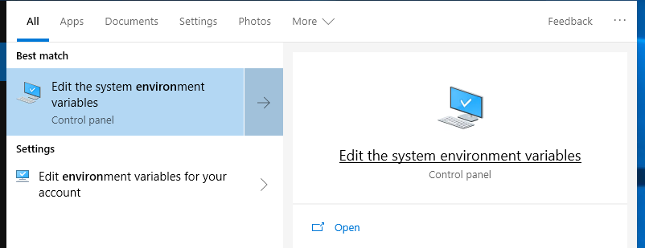
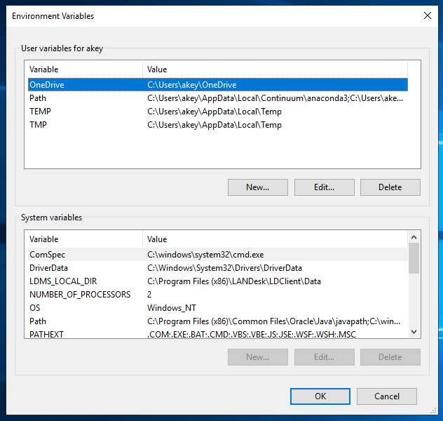
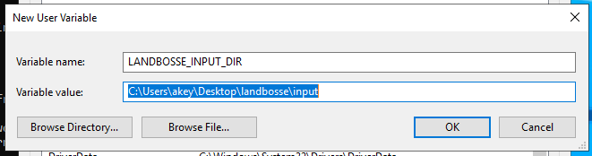
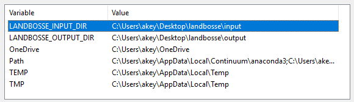

# LandBOSSE Installation

## Windows Installation for End Users

### Step 1: Install Anaconda

You will need the Anaconda distribution of Python. You need the distribution with **Python 3.7** or higher.

[https://www.anaconda.com/distribution/](https://www.anaconda.com/distribution/)

### Step 2: Launch the Anaconda Prompt

LandBOSSE is a command line tool. You will need to launch the Anaconda prompt (either "Anaconda Prompt" or "Anaconda Powershell Prompt" will work.) Search your start menu for "Anaconda3" and you should get a folder ike the one below which lets you select the Anaconda prompt. As you type commands, you should not get error messages. This is indicated by *no messages* after you type the command.


### Step 3: Create three data folders

You need 3 folders on your desktop for LandBOSSE data. You can certainly put them in a place other than your desktop, but you will need to modify the commands below if you do.

Your command prompt will look something like the following:


This is what you should type:

```
md \Users\%USERNAME%\Desktop\landbosse
md \Users\%USERNAME%\Desktop\landbosse\input
md \Users\%USERNAME%\Desktop\landbosse\output
```

### Step 4: Get the source code

If you are familiar with `git` and GitHub and have a workflow to use to obtain the source code, please skip to the next step. 

However, if you are unfamiliar with `git` and GitHub you can simply download the `.zip` file. Find the main GitHub page for this project [https://github.com/WISDEM/LandBOSSE](https://github.com/WISDEM/LandBOSSE).


### Step 5: Get the source code ready

Open the `.zip` file. Copy the single directory within it to the `landbosse` folder on the desktop. Rename the directory to `LandBOSSE-dev`

Your first step upon opening the `.zip` will be this:


Move the file into position like this.


This is the directory configuration you need to run LandBOSSE.

### Step 6: A word of caution about input files

If you are familiar with GitHub and `git` please read the following warning. If you are unfamiliar please skip to Step 7.

Input files shouldn't be placed in the LandBOSSE source code directory. *This creates a risk that proprietary input data will become visible in a source code repository.* This risk is mitigated by using the folder structure you just created above.

### Step 7: Set environment variables

We just made a folder structure for LandBOSSE. In order for LandBOSSE to know where these folders are, we need to make environment variables pointing to the files. If you want to (optionally) know more about environment variables you can [read about them on Wikipedia](https://en.wikipedia.org/wiki/Environment_variable). However, all you really need to know right now is that they are keywords that specify folders for LandBOSSE. We will use the Windows control panel to set these variables. Search for "environment variable" in the start menu, and open the control panel



Click on the above start menu option above. Then click on the `Environment Variables` button in the lower right. You will then see the following dialog box:



Click on the **New** button under **User variables for your_username**. You will be presented with



Enter the variable name `LANDBOSSE_INPUT_DIR` and browse the directory where we have the landbosse inputs. Click OK. Then open the same dialog box, enter the variable name `LANDBOSSE_OUTPUT_DIR` and browse to your outputs directory. Click OK. When you are done, you should see the environment variables set like this. The selection of environment variables will probably look different but you will have the `LANDBOSSE_INPUT_DIR` and `LANDBOSSE_OUTPUT_DIR` set up. Check for those. Also



Click OK.

### Step 8: Copy your data into the input folder

Now you can copy the template input files into the LandBOSSE input folder. Navigate to the `project_input_template` folder in the LandBOSSE source directory, as shown below.


Following this example, the project input template lives in the `C:\Users\YOUR USERNAME\Desktop\landbosse\LandBOSSE\project_input_template` folder. Substitute `YOUR USERNAME` with the username you use to log in to your computer.

Paste these files into the input folder you made earlier:


Your result will look like this when you are done:


### Step 9: Install shapely

Assuming you have been following along the folder placement we have been using so far, open an Anaconda prompt. Type the following command to get to the LandBOSSE folder:

You will need Python 3.7 for this step.

```
c:
cd \Users\%USERNAME%\Desktop\landbosse\LandBOSSE-dev
```

In a browser enter the following URL

[https://www.lfd.uci.edu/~gohlke/pythonlibs/#shapely](https://www.lfd.uci.edu/~gohlke/pythonlibs/#shapely)

These are pre-built versions of shapely. What you need is to install one of these prebuilt version. First we need to download it. On the web page you just opened, click on `Shapely-1.6.4.post1-cp37-cp37m-win_amd64.whl` to download it. (It is easier if you type Ctrl-F and search for `Shapely` to find the file). Then type the following command to install it (assuming it is in your `Downloads` folder)

```
pip install C:\Users\%USERNAME%\Downloads\Shapely-1.6.4.post1-sp37-cp37m-win_amd64.whl
```

The command should result in a message that begins Then install landbosse itself:

```
pip install -e .
```

Note that there is a space between `-e` and `.`

## Step 10: Copy and modify template input files to input folder

In the `LandBOSSE` directory you will find a folder named `project_input_template`. Copy (do not move) the contents of this folder into the `inputs` folder you created and specified in Steps 3 and 7. Retain the folder structure in `project_input_template`.

The file named `projects_list.xlsx` must keep the same name. The names of the project data files in the `project_data` folder must match the project names in `projects_list.xlsx`.

### Step 11: Run LandBOSSE

From the `LandBOSSE` folder, type the following command:

``` 
python main.py
```

### Step 12: Examine the results

Your output is in the `output` directory of your landbosse directory!
